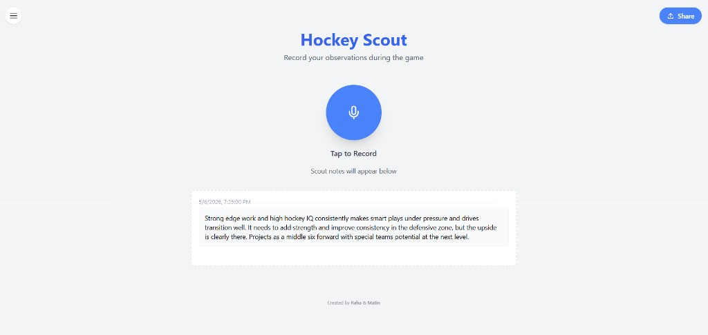
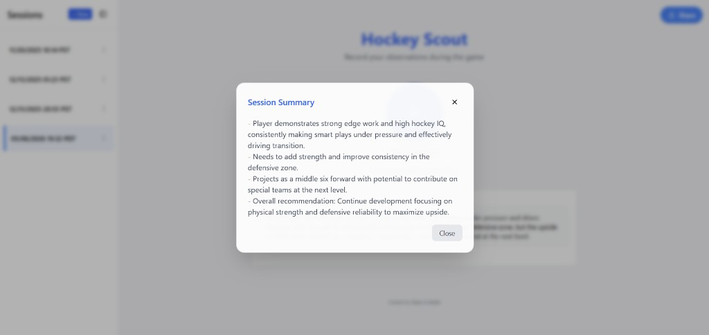

# Hockey Scout

Hockey Scout is a voice-first scouting companion that helps scouts capture in-game observations quickly, organize notes by session, and generate concise session summaries. The app is designed to keep note-taking fast during live play while making post-game review and sharing easier.

## Main Page

## Session Summarizer

The session summarizer analyzes all transcript entries in a selected session and returns a clean, structured summary of key observations, development points, and overall recommendations.

## What the Project Includes

- A responsive web interface for recording and managing scouting sessions.
- Audio-to-text transcription flow for turning spoken observations into saved notes.
- Session-level summarization for quick review of scouting takeaways.
- Session sharing support via email, with optional summary inclusion.
- Backend APIs and persistent storage for sessions and transcripts.

## Copyright

© 2026 Hockey Scout. All rights reserved.
